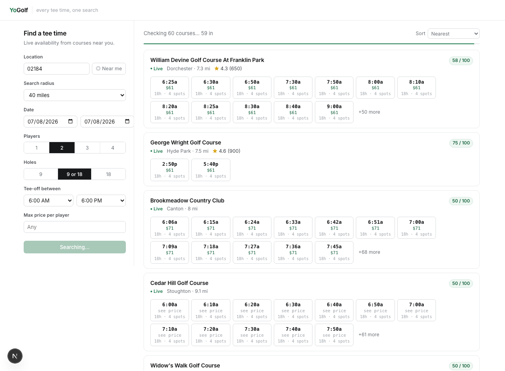

# YoGolf

Every tee time, one search. YoGolf aggregates **live** tee-time availability
from golf courses onto a single map-free search page — filter by location,
radius, date range, players, tee-off window, price, and 9/18 holes; sort by
nearest, price, or best course.

Phase 1 covers **Massachusetts**: 147 public courses, **106 on live-availability
providers** (the rest appear with a booking link). Private / members-only clubs
are deliberately excluded — every course shown is open to the public.



## How it works

There is no national tee-time API. Courses sit on a handful of booking
platforms, several of which expose the same JSON their own booking widgets
call. YoGolf hits those directly through per-provider **adapters** and merges
the results. Courses on platforms we can't read live (or that gate their tee
sheet behind login) fall back to a "Check availability" booking deep-link, so
they still appear in search.

```
Browser ──► /api/search (NDJSON stream)
                │  radius filter (SQLite + haversine)
                │  fan-out to adapters, 9s timeout each, 2-min cache
                ▼
   TeeItUp · ForeUp · Chronogolf · CPS · TeeSnap · Club Caddie · fallback
```

### Providers

| Provider | Status | Notes |
|----------|--------|-------|
| **TeeItUp** | ✅ live | `kenna.io` `/v2/tee-times` (alias + facilityIds; UTC→local). 25 MA courses — the dominant MA public platform. |
| **ForeUp** | ✅ live | `foreupsoftware.com` booking API (`api_key=no_limits`). 44 MA courses. |
| **Chronogolf** | ✅ live | Lightspeed marketplace (`/marketplace/clubs/{id}/teetimes` + the club's affiliation id). 16 MA courses. |
| **CPS Golf** | ✅ live | `*.cps.golf` (token → options → txn → teetimes). 10 MA courses inc. Boston municipals. |
| **TeeSnap** | ✅ live | `{sub}.teesnap.net/customer-api/teetimes-day` JSON. 6 MA courses. |
| **Club Caddie** | ✅ live | `apimanager-cc{N}.clubcaddie.com/webapi/TeeTimes` (session + apikey; parse slot HTML). 5 MA courses. |
| **fallback** | ✅ | Booking deep-link for the rest. |

**106 of 147** MA courses resolve live tee times across six reverse-engineered
platforms; the remaining 41 are bookable links. Each provider has a
`*_harvest.ts` / `*_discover.ts` finder and a `build_*_seed.ts`;
`detect_provider.ts` + `find_sites_detect.ts` classify a course's system from
its website.

The 41 fallbacks expose **no public tee-time data through any channel** — this
is verified, not assumed. Their buckets:
- **Login-gated** — ForeUp tee sheets that answer `You are not logged in`,
  Chelsea Reservations and TeeQuest portals (ASP.NET login, "NonMember #").
  The operator requires a registered account to see availability.
- **No online booking** — small municipals that take tee times by phone only;
  there is no inventory to show.
- **Cloudflare-walled front-ends** — EZLinks/Pinehills and two `cps.golf` sites.

Cross-check via **GolfNow** (the master aggregator, whose summaries API *is*
reachable server-side, `/api/tee-times/tee-times/facility/{id}/summaries/...`):
every one of these courses returns `204` / `numberOfTeeTimesAvailable: 0`.
GolfNow only carries courses already on the TeeItUp network (same parent), so it
adds no course we don't already have live. In short, the courses without live
times have *chosen not to publish tee times publicly* — to appear live they'd
need to enable public online booking. All still show a real booking link.

## Run it

```bash
npm install
npx tsx scripts/seed.ts     # build data/courses.db from data/seed/*.json
npm run dev                 # http://localhost:3000
```

Tests (drives real searches through the UI with a live dev server):

```bash
npx playwright test
```

## Project layout

```
app/
  page.tsx              search UI (streaming results, client-side sort)
  api/search/route.ts   radius filter → adapter fan-out → NDJSON stream
  api/geocode/route.ts  zip → lat/lng (bundled dataset)
lib/
  adapters/             one file per booking platform + registry
  search.ts             fan-out, per-adapter timeout, cache, sort
  db.ts distance.ts score.ts cache.ts geo.ts
data/
  seed/*.json           course records (committed); ratings_*.json overrides
  zips.csv ma_towns.tsv geocoding datasets
scripts/
  seed.ts               (re)build courses.db
  probe.ts              probe one course or --all live; pass/fail table
  detect_provider.ts    classify a course's booking system from its website
  find_sites_detect.ts  guess a course's domain, then detect its provider
  foreup_harvest.ts     scan ForeUp ids → course metadata + schedule ids
  teeitup_harvest.ts / teeitup_discover.ts    kenna.io alias + facilityIds
  chronogolf_harvest.ts · cps_discover.ts · teesnap_discover.ts · clubcaddie_harvest.ts
  build_*_seed.ts       turn harvested config into <provider>_ma.json
  build_ma_seed.ts / build_directory_seed.ts  ForeUp scan + directory fallbacks
```

## "Best course" score

`lib/score.ts` shrinks a course's Google rating toward the statewide mean
(Bayesian prior, so a 5.0 with 12 reviews doesn't outrank a 4.6 with 2,000),
blends GolfPass's Golfers' Choice rating when present, and adds a bounded bonus
for editorial top-list appearances. Rankings currently seeded from GolfPass
Golfers' Choice 2026 (`data/seed/ratings_ma.json`).

## Adding courses (the coverage sweep)

The goal is that **every** public course a golfer would find on Google appears
in YoGolf. To extend coverage:

1. **Find candidates** — course directories + `web search "golf near {town}"`.
2. **Identify the booking provider** — open the course's "Book tee time" link.
   - ForeUp (`foreupsoftware.com/booking/{id}`) → `npx tsx scripts/foreup_harvest.ts {id}` for schedule ids, add a `foreup` record.
   - `*.cps.golf` → `npx tsx scripts/cps_probe_site.ts {host}` for course ids, add a `cps` record.
   - `chronogolf.com/club/{slug}` → `npx tsx scripts/chronogolf_harvest.ts {slug}` for club/course/affiliation ids, add a `chronogolf` record.
   - Otherwise → a `fallback` record (booking link).
3. **Public only** — `data/seed/_exclude_ma.json` drops members-only clubs and
   ForeUp test/demo accounts. Semi-private courses that sell public tee times
   are kept. Add newly found private clubs there.
4. **Verify** — `npx tsx scripts/probe.ts {course-id}` should return live slots
   (or `--all` for the whole DB). `npx tsx scripts/verify_search.ts` checks the
   filters against a running server.
5. `npx tsx scripts/seed.ts` and re-run.

ForeUp schedules are seasonal: a course marked fallback with SCHEDULES=false
can become bookable in-season — re-harvest periodically (scripts/foreup_harvest.ts).

To grow beyond MA, drop new `data/seed/*.json` files for the target state; the
zip dataset (`data/zips.csv`) is already national.

## Honest limitations

- Provider endpoints are unofficial and per-course config varies; the probe
  script + per-course `provider_config` absorb the differences.
- Some ForeUp courses hide green-fee rates until login → slots show "see price".
- The 41 fallback courses (login-gated portals, Cloudflare-walled
  GolfNow/EZLinks/CPS, or town-custom widgets) appear with a booking link.
- Google ratings are enriched for a subset; the "best course" score falls back
  to a statewide-mean prior for the rest.
